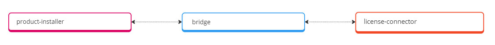

# Bridges
Bridges (Brücken zwischen dem Product Installer und einem Shop-System), spielen eine entscheidende Rolle bei der Verbindung zwischen verschiedenen Shop-Systemen und dem Produkt Installer. Sie ermöglichen es, Informationen über das jeweilige Shop-System und dessen API bereitzustellen, die anzuzeigenden Masken zu konfigurieren und den Installationsprozess für ein Produkt vorzugeben.

Eine Bridge stellt immer eine direkte Verbindung zu einem spezifischen Shop-System her. Durch die Integration einer Bridge kann der Produkt Installer nahtlos mit dem ausgewählten Shop-System kommunizieren und relevante Daten austauschen. Dies umfasst Informationen über Produkte, Kategorien, Aufgaben zur Installation und andere relevante Daten, die für eine reibungslose Installation benötigt werden.

Um die Kommunikation zwischen Bridges und den jeweiligen Shop-Systemen zu ermöglichen, wird eine zusätzliche Erweiterung benötigt, die als "[License-Connector](connector/README.md)" bezeichnet wird um im Shop-System installiert sein muss.

Eine der zentralen Funktionen von Bridges besteht darin, das Verhalten des Produkt Installers zu steuern. Dies bedeutet, dass die Bridge die Masken und Vorgehensweisen für die Installation eines Produkts festlegt. Sie gibt dem Benutzer klare Anweisungen, welche Schritte erforderlich sind, um das gewünschte Produkt erfolgreich zu registrieren und zu installieren.

?> Wenn du dich für die Erstellung von Bridges interessierst, klicke [hier](bridges/structure.md).
